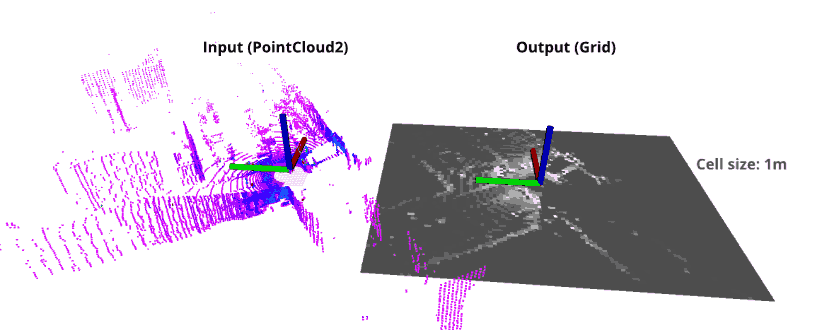
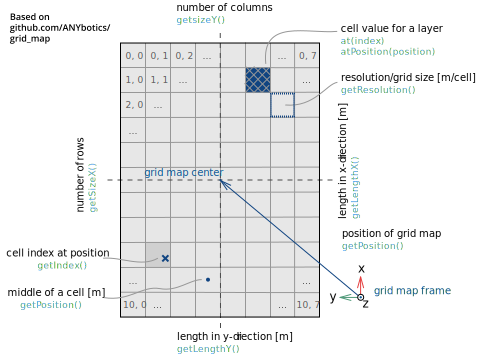

# `pointcloud_to_grid` ROS2 package
This python package converts `sensor_msgs/PointCloud2` LIDAR data to `nav_msgs/OccupancyGrid` 2D map data based on intensity and / or height


## Build
```
cd ~/ament_python_ws/src 
git clone https://github.com/wvu-robotics/pointcloud_to_grid_ros2.git
colcon build
```
Don't forget to `source ~/ament_python_ws/install/setup.bash`. *Note*: [`colcon build`](https://docs.ros.org/en/humble/Tutorials/Beginner-Client-Libraries/Colcon-Tutorial.html) is recommended


## Features
- Few dependencies (ROS2) [ROS2 installation](https://docs.ros.org/en/humble/Installation.html)
- Simple as possible
- Fast

*Tested in ROS2 Humble, other distributions may work but not guaranteed*

## Conventions & definitions


# Getting started

Issue the following commands to play sample data, and start the algorithm with visualization.

In a **new terminal** run the `pc2_to_grid.launch.py` launch file:

```
ros2 launch pointcloud_to_grid pc2_to_grid.launch.py
```

In a **new terminal** go to your bag folder (e.g. `~/Downloads`):

```
cd ~/Downloads
```

Play rosbag:

```r
ros2 bag play -l ~/Downloads/your-bag-folder-name
```

Start the visualization in a **new terminal** :
```r
rviz2
```

Select the `Add` button located in the topic menu on the left. From the topic type options, choose `Map` and once it appears in the topic menu select either the intensity or height based occupancy grid.


## Related solutions
- [github.com/ANYbotics/grid_map](https://github.com/ANYbotics/grid_map) - This is a C++ library with ROS interface to manage two-dimensional grid maps with multiple data layers. 
- [github.com/306327680/PointCloud-to-grid-map](https://github.com/306327680/PointCloud-to-grid-map) - A similar solution but instead PointCloud2 it uses PointCloud


## Cite & paper

Credit goes to [horverno](https://github.com/horverno), [mesmatyi](https://github.com/mesmatyi), and [szepilot](https://github.com/szepilot) on github for designing the algorithm this package uses, as well as creating a ROS implementation this package was based on.

[Széchenyi University's Research Center's original package](https://github.com/jkk-research/pointcloud_to_grid)